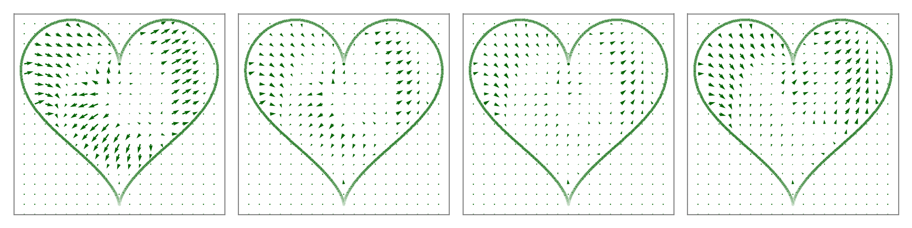

# Reflected Schrödinger Bridge

This repo shows how to implement **Reflected Schrodinger Bridge**. 

### Part I: Reflected Langevin dynamics

The folder **sampling_bounded_domain** includes two jupyter notebooks to show how to implement reflected Langevin dynamics using the cache trick.

The following is a gif demo to show the trajectories.

  
   

### Part II: Reflected Schrödinger bridge

The folder **rSB-FBSDE** demonstrates constrained generative modeling through reflected Schrödinger bridge.

A demo of transport from moon to spiral on the heart domain.

  
   

The vector field of the moon to spiral transport.

  
   

