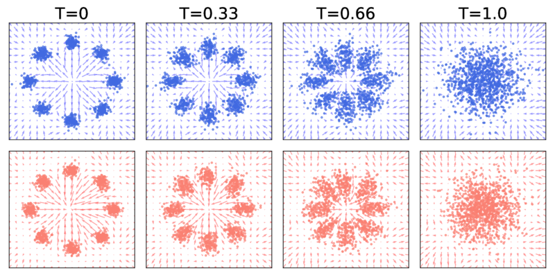
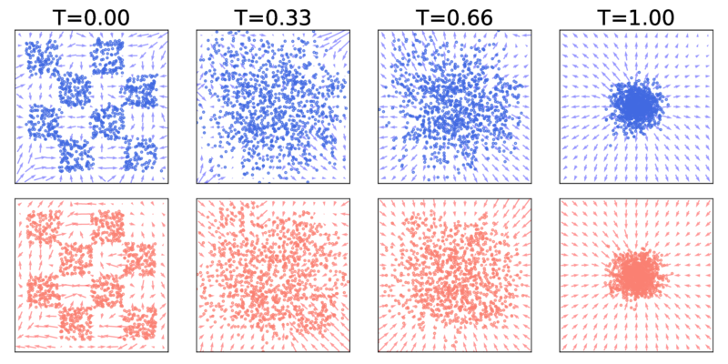
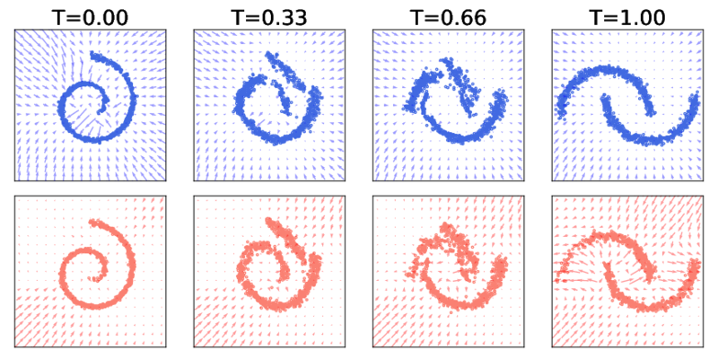

# Reflected Schrödinger Bridge using Reflected Forward-Backward SDEs with Robin and Neumann boundary conditions


## Examples

| p0 ⇆ pT (`--problem-name`)  | Results (blue/left: p0 ← pT, red/right: p0 → pT) |
|-------------------------|-------------------------|
| Mixture Gaussians ⇆ Gaussian (`gmm`) |  |
| CheckerBoard ⇆ Gaussian (`checkerboard`) |  | 
| Spiral ⇆ Moon (`moon-to-spiral`) |  | 
| CIFAR-10 ⇆ Gaussian (`cifar10`) | <p float="left">    </p> |

## Installation

This code is developed with Python3. PyTorch >=1.7 (we recommend 1.8.1). First, install the dependencies with [Anaconda](https://www.anaconda.com/products/individual) and activate the environment `sb-fbsde` with
```bash
conda env create --file requirements.yaml python=3
conda activate sb-fbsde
```

## Training

```bash
python main.py \
  --problem-name <PROBLEM_NAME> \
  --forward-net <FORWARD_NET> \
  --backward-net <BACKWARD_NET> \
  --num-FID-sample <NUM_FID_SAMPLE> \ # add this flag only for CIFAR-10
  --dir <DIR> \
  --log-tb 
```

To train an SB-FBSDE from scratch, run the above command, where
- `PROBLEM_NAME` is the dataset. We support `gmm` (2D mixture of Gaussian), `checkerboard` (2D toy dataset), `moon-to-spiral`, `mnist`, `celebA32`, `celebA64`, `cifar10`.
- `FORWARD_NET` & `BACKWARD_NET` are the deep networks for forward and backward drifts. We support `Unet`, `nscnpp`, and a `toy` network for 2D datasets.
- `NUM_FID_SAMPLE` is the number of generated images used to evaluate FID locally. We recommend 10000 for training CIFAR-10. Note that this requires first downloading the [FID statistics checkpoint](https://github.com/ghliu/SB-FBSDE#evaluating-the-cifar-10-checkpoint). 
- `DIR` specifies where the results (e.g. snapshots during training) shall be stored.
- `log-tb` enables logging with Tensorboard.

Additionally, use `--load <LOAD>` to restore previous checkpoint or pre-trained model.
For training CIFAR-10 specifically, we support loading the pre-trained [NCSN++](https://drive.google.com/drive/folders/1sP4GwvrYiI-sDPTp7sKYzsxJLGVamVMZ) as the backward policy of the first SB training stage (this is because the first SB training stage can degenerate to denoising score matching under proper initialization; see more details in [Appendix D of our paper](https://openreview.net/pdf?id=nioAdKCEdXB)).


### Acknowledge

This repo heavily depends on [link](https://github.com/ghliu/SB-FBSDE)
