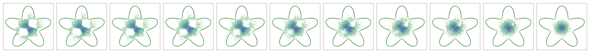
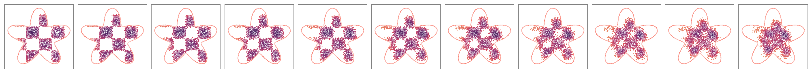
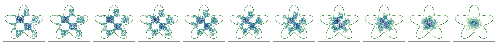
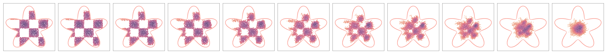
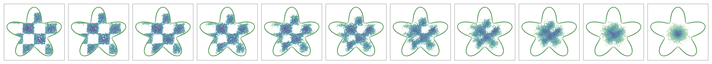
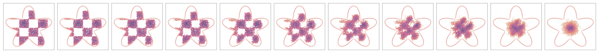

# Reflected Schrödinger Bridge using Reflected Forward-Backward SDEs with Robin and Neumann boundary conditions

## Installation

Similar to [SB-FBSDE](https://github.com/ghliu/SB-FBSDE), this code is built based on Python3 and PyTorch >=1.7 (we recommend 1.8.1). You can first install the dependencies from [Anaconda](https://www.anaconda.com/products/individual) and activate the environment `rsb-fbsde` as follows

```bash
conda env create --file requirements.yaml python=3
conda activate rsb-fbsde
```

## Training

For example, if you want to generate checkboard in the flower domain, you can try
```bash
python main.py --problem-name checkerboard --forward-net toy  --backward-net toy --dir output --log-tb --ckpt-freq 2
```

IPF stage 2
<p float="left">
  
  
</p>

IPF stage 10
<p float="left">
  
  
</p>

IPF stage 20
<p float="left">
  
  
</p>


For examples like Gaussian mixture on octogon and moon-to-spiral in heart, you can try:
```bash
python main.py --problem-name gmm --forward-net toy  --backward-net toy --dir output --log-tb --ckpt-freq 2
python main.py --problem-name moon-to-spiral --forward-net toy  --backward-net toy --dir output --log-tb --ckpt-freq 2
```

##  Acknowledgement

This repo heavily depends on [SB-FBSDE](https://github.com/ghliu/SB-FBSDE).
