## Demo of Reflected Langevin Dynamics

#### Simulation of Langevin dynamics (VP-SDE) on various domains

Stage 1/3 

  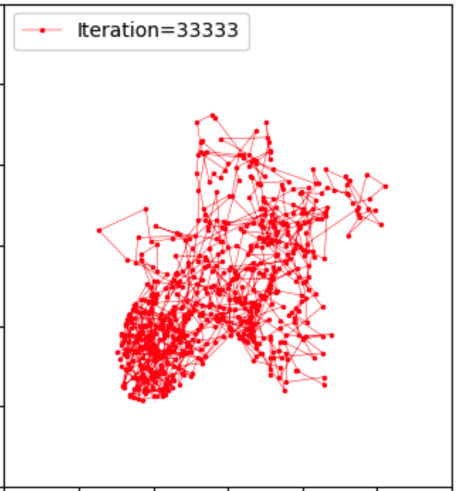
  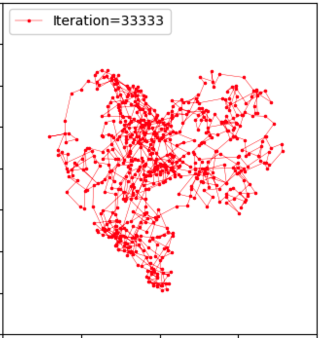 
  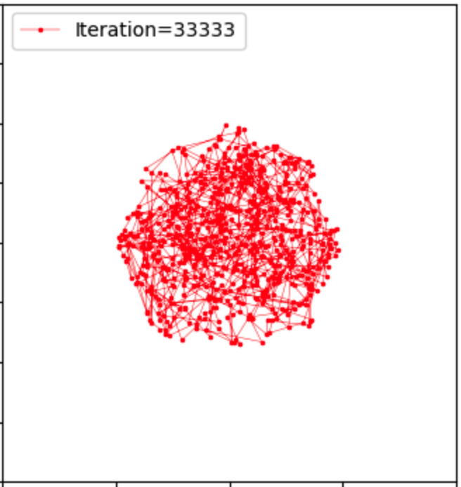
  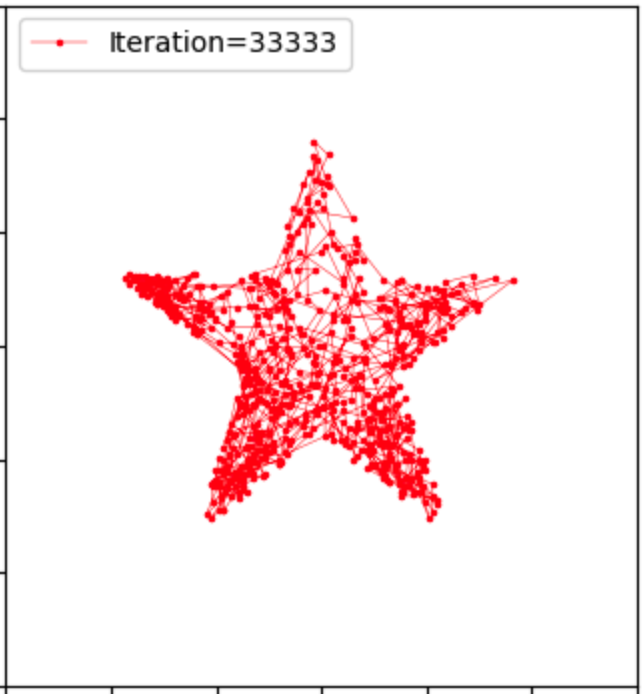

Stage 2/3 

  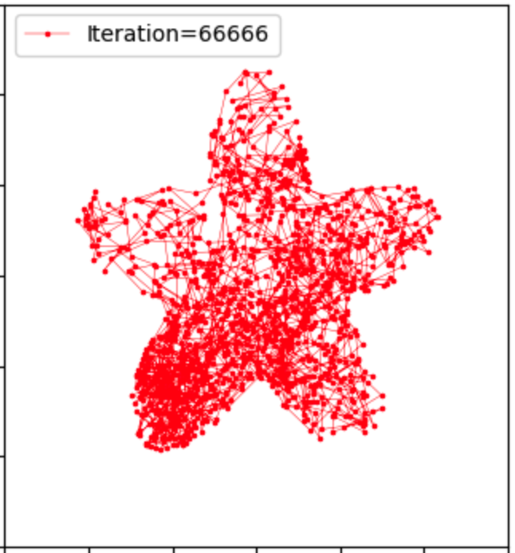
  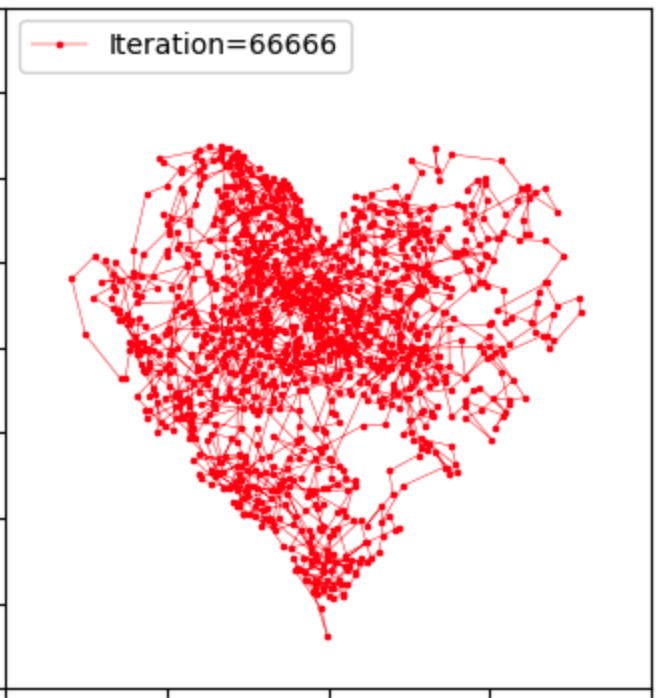 
  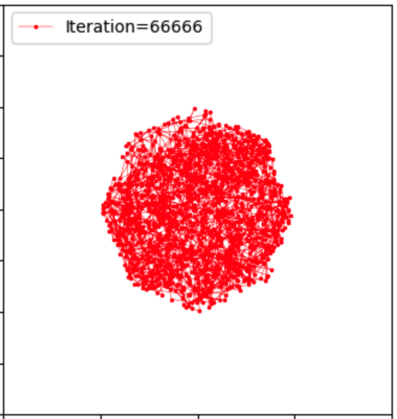
  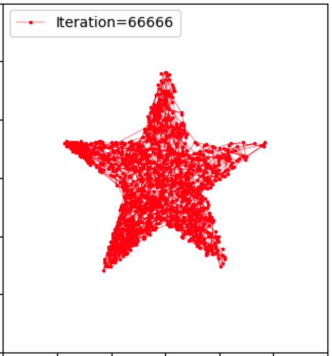

Stage 3/3 

  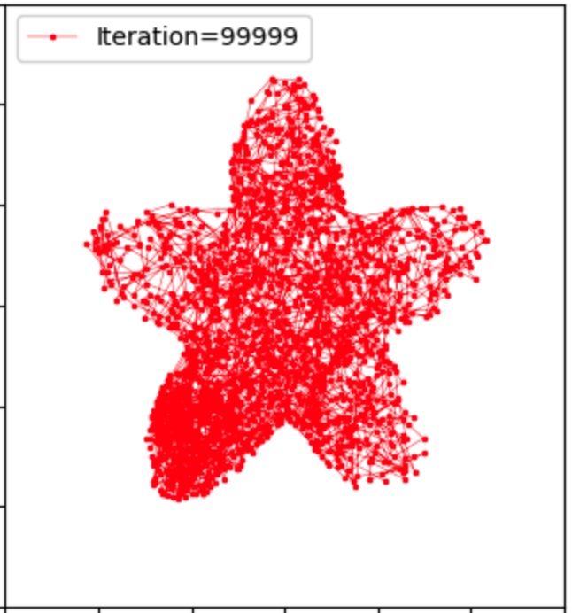
  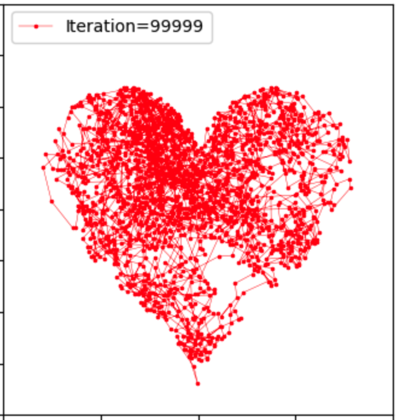 
  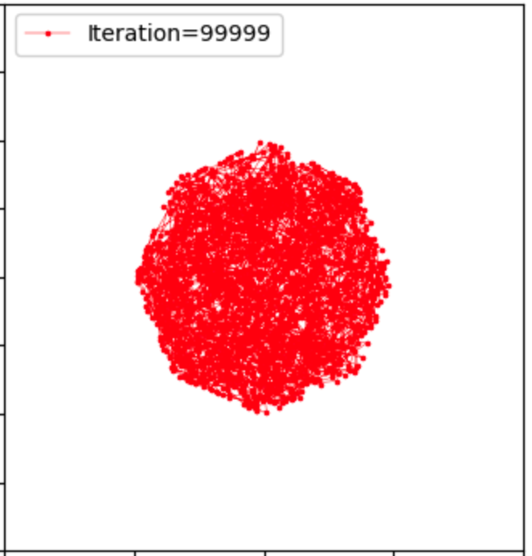
  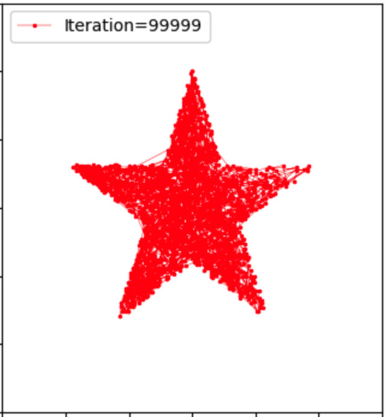

More iterations result in better figures. 

We choose the grid of the radius and the curves to be grid_radius=1e-2, grid_curve=1e-3, respectively. A smaller value leads to more refined trajectories but becomes more expensive.